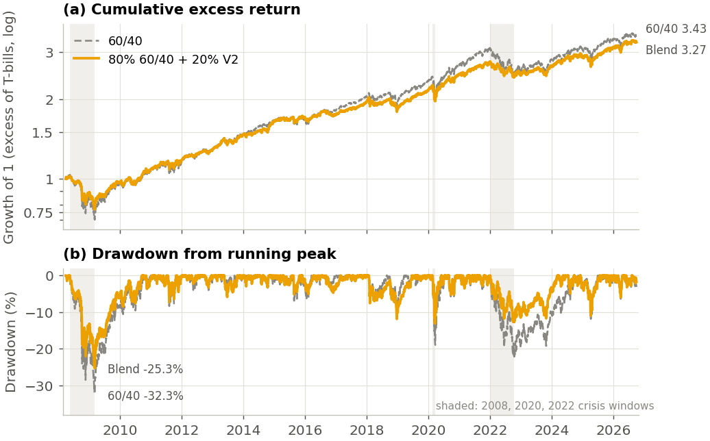

# Time-Series Momentum with Volatility Targeting and Regime-Conditioned Exposure

**A ten-ETF trend-following strategy (2008 to 2026) earns a Sharpe ratio of 0.45 after volatility targeting and
gained in the three largest equity crashes. A pre-specified 20% allocation beside a 60/40 portfolio cut the
portfolio's maximum drawdown from -32.3% to -25.3%, though the Sharpe gain is not significant.**

- **One-page summary:** [SUMMARY.pdf](SUMMARY.pdf)
- **Full paper (24 pages):** [paper/Time_Series_Momentum_with_Volatility_Targeting_and_Regime_Conditioned_Exposure.pdf](paper/Time_Series_Momentum_with_Volatility_Targeting_and_Regime_Conditioned_Exposure.pdf) (LaTeX source: [`paper/main.tex`](paper/main.tex))



*60/40 against 80% 60/40 + 20% V2, daily. The blend's drawdowns are shallower in 2008, 2020 and 2022; its
cumulative return finishes slightly lower because its mean is lower.*

I implement the strategy of Moskowitz, Ooi and Pedersen (2012) on ten ETFs across equities, Treasuries,
commodities and currencies, over 222 months (April 2008 to September 2026), and decompose it layer by layer.
**Every design parameter was committed to version control before the first backtest was run**, so the git
history documents that nothing was tuned to the results.

---

## Key findings

| Strategy (net of 10 bps) | Ann. excess return | Volatility | Sharpe (Lo SE) | Max drawdown | Monthly skew |
|---|---|---|---|---|---|
| V1: raw TSMOM, equal notional | 1.79% | 7.0% | 0.26 (0.23) | -25.8% | -0.50 |
| **V2: inverse-vol + 10% portfolio vol target** | **5.07%** | **11.3%** | **0.45 (0.23)** | **-26.8%** | **+0.33** |
| Long-only risk parity (same construction, all long) | 3.19% | 11.0% | 0.29 (0.23) | -30.1% | -0.35 |
| SPY / 60-40 (gross) | 11.18% / 7.15% | 15.6% / 9.7% | 0.72 / 0.74 | -51.8% / -32.3% | -0.58 / -0.62 |

- **Volatility targeting is the layer that matters.** It raises the Sharpe ratio from 0.26 to
  0.45 and turns monthly skewness from negative to positive (the signature of trend
  following), but the improvement is not statistically significant (paired stationary
  bootstrap p = 0.19).
- **Crisis alpha.** V2 gained 9.2%, 12.6% and 30.6% over the three largest equity drawdowns
  of the sample (2008 to 2009, 2020, 2022) while SPY fell 52%, 34% and 25%, and averaged
  +1.8% in SPY's worst decile of months.
- **The ETF implementation is the real strategy:** correlation 0.77 with the AQR futures
  TSMOM factor (beta 0.66, R² 0.60, insignificant alpha).
- **Timing trend with a regime model does not work.** The walk-forward Markov-switching overlay
  lowers the Sharpe ratio from 0.45 to 0.39. Normalised to V2's average exposure it still trails V2
  (0.40, p = 0.33), so it adds leverage, not timing. Full-sample smoothed probabilities would have
  faked a +0.12 Sharpe gain, a common lookahead error.
- **As a diversifier (pre-specified, added after the main results).** 80% 60/40 + 20% V2, rebalanced monthly:
  maximum drawdown -32.3% to -25.3%, smaller loss in all six equity crisis windows (2022: -21.6% to -12.6%),
  Sharpe 0.74 to 0.86 but not significant (bootstrap p = 0.08), and a lower mean (7.15% to 6.74%). For an
  equity-only investor (80% SPY + 20% V2): drawdown -51.8% to -42.7%, Sharpe 0.72 to 0.80 (p = 0.04, or 0.08
  after a Bonferroni adjustment for testing two blends). The 20% weight was fixed in advance, not optimised.
- **Honest significance.** After deflating for the 26 configurations examined (Bailey and
  López de Prado 2014), V2's Sharpe ratio is not significant at 5% (DSR 0.68). The evidence
  supports trend following as a crisis diversifier, not as a reliably profitable stand-alone
  strategy over this period.

---

## Method

| Component | Choice | Why |
|---|---|---|
| Universe | SPY, EFA, EEM; IEF, TLT; GLD, DBC; UUP, FXY, FXA | Four asset classes; FX uses three different exposures rather than near-duplicates |
| Returns | Daily total returns minus the T-bill rate (^IRX, actual/360) | ETFs are funded; futures (the literature's setting) earn excess returns |
| Signal | Sign of trailing 12-month excess return (1/3/6 months and a blend reported) | MOP headline, fixed in advance |
| Volatility | EWMA of daily excess returns, centre of mass 60 days | MOP ex-ante estimator |
| Risk allocation | Equal ex-ante risk per asset class, then 10% portfolio vol target with trailing correlations | Within-class correlations are high (equities 1.26, rates 1.08 effective bets) |
| Regime overlay | 2-state Markov-switching model on the weekly trend payoff, refitted monthly, **filtered** probabilities only | Measures "is trend paying" directly; smoothed probabilities use future data |
| Engine | Daily self-financing backtest, monthly rebalance, weight drift, 10 bps per unit traded | Captures intra-month drawdowns (March 2020) |
| Inference | Newey-West t; Lo (2002) Sharpe SEs; paired stationary bootstrap for Sharpe differences; deflated Sharpe ratio | Variants are highly correlated, so naive Sharpe comparisons are invalid |

**Validation.** 42 automated tests, including truncation tests: signals, volatilities,
weights, backtest returns and regime probabilities are recomputed after deleting all
data after a cut-off date (including mid-crash March 2020), and every earlier value must be
unchanged. The engine is checked against hand-calculated cases, the targeted ex-ante
volatility against an independent covariance calculation, and the total-return prices
against closing prices plus distributions.

**Problems found and disclosed rather than hidden** (details in the paper): 25 early regime
refits converged to degenerate outlier-absorbing solutions; realised volatility runs 13%
above target because of volatility jumps; and every post-results decision is labelled as
such.

---

## Reproduce

```bash
pip install -r requirements.txt
cd src
python fetch_prices.py && python fetch_rates.py && python fetch_benchmarks.py
python run_all.py          # every result, table and figure (about 6 minutes)
cd .. && python -m pytest  # 42 tests
```

Downloads are kept separate from the pipeline because Yahoo revises adjusted prices over
time; everything downstream of `data/` is deterministic. Paper (`paper/main.tex`) and summary
(`paper/summary.tex`): compile with pdflatex (standard packages only).

| Stage | Script | What it does |
|---|---|---|
| 0 | `config.py` | Every parameter, committed before any result |
| 1 | `fetch_*.py`, `check_data.py` | Prices, distributions, rates, AQR factors; coverage, total-return and extreme-move checks |
| 2 | `run_stage2.py` | Excess returns, EWMA volatility, signals, pooled predictive regressions |
| 3 | `backtest.py`, `run_stage3.py` | Daily engine, raw TSMOM (V1) |
| 4 | `portfolio.py`, `run_stage4.py` | Volatility targeting (V2), benchmarks, spanning, AQR validation |
| 5 | `regime.py`, `run_stage5.py` | Walk-forward Markov-switching overlay (V3), lookahead illustration |
| 6 | `run_stage6.py` | Crisis windows, smile, costs and financing, robustness grid, deflated Sharpe |
| 6b | `run_overlay_norm.py` | Regime overlay with exposure held constant (pre-registered check) |
| 6c | `run_blend.py` | Trend as a diversifier: pre-registered 80/20 blends with 60/40 and SPY |
| 7 | `make_figures.py`, `make_tables.py` | Every figure and table in the paper, from saved outputs |

## References

Moskowitz, Ooi and Pedersen (2012), *Time series momentum*, JFE. Kim, Tse and Wald (2016),
*Time series momentum and volatility scaling*, JFM. Huang, Li, Wang and Zhou (2020), *Time
series momentum: is it there?*, JFE. Hamilton (1989), Econometrica. Bailey and López de Prado
(2014), JPM. Full list in
the paper.
